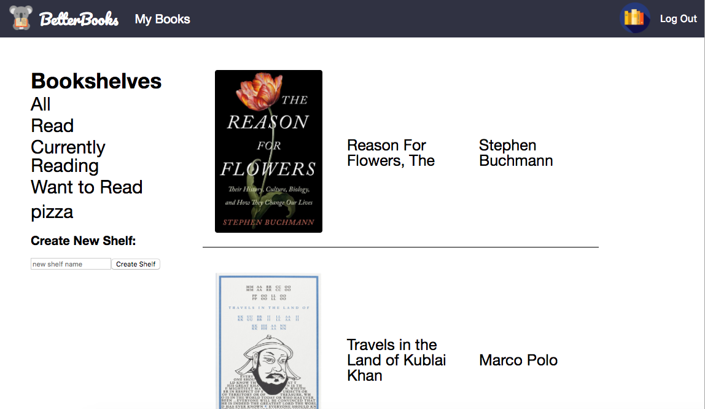

# BetterBooks

[BetterBooks live](https://www.findabetterbook.com/)

BetterBooks is a web-app inspired by [Goodreads](https://www.goodreads.com/) that allows users to track which books they have read and organize them into bookshelves. It is a full-stack, single page web application that was built using Ruby on Rails a PostgreSQL database, and React/Redux.

## Technologies

BetterBooks uses Rails on the back-end. Rails is a MVC that we use to fetch data from our PostGreSQL database and forward our JSON data to the front end.

The front end is written in JavaScript and implemented using the React library. Redux is also used so the app utilizes a unidirectional flow of data for altering its state and triggering rendering.


## Features & Implementation

* Secure front-end and back-end user authentication using BCrypt
* Library of books that can be browsed
* Mark book to indicate if a user has read it, is currently reading it, or wants to read it.
* Ability to add books to shelves to further organize books that interest a user.

### Read Status


Users have the ability to alter the read status of a book. When they alter a status it is automatically added to that users "My Books".

### User Book Shelves



Users can organize their books under different read statuses or into different bookshelves for easier access.

If a book's read status is updated it updates all instances of that book in the users library.

```ruby
class Api::ShelvingsController < ApplicationController
  def show
    @shelvings = current_user.shelvings.where(book_id: params[:book_id])
  end

  def update
    shelvings_to_update = current_user.shelvings.where(book_id: params[:book_id])
    shelvings_to_update.update_all(read_status: params[:read_status])
    @shelvings = shelvings_to_update
    render "/api/shelvings/show"
  end
```

Associations between the user, the users bookshelves, and the the users books(called shelvings) connect a user to their books.


## Project Design

BetterBooks was designed and implemented over the course of 10 days. The original [proposal](https://github.com/Sloq/Full_Stack_Project/tree/master/docs) covers MVP features, timeline, and other documentation.

## Future Improvements
### Add reviews to books
Users need to be able to add reviews to books, the rating will show the reviewers information, the review, and a star rating of the book. The overall rating will be tracked to display an average score.
### Search function to look up books
Currently users must click on a book to access it and add it to there library. A search feature would allow users to more easily find a book(or find information from book descriptions) and add it to there library.
### Add user profiles
Allow users to view their own profile and view the profiles and bookshelves of other users.
### Add author pages
Authors should be clickable to see all the authors books and info on the author.
### Add tags to book
Book tags would allow another option for users to parse through book E.g. a "fantasy" tag returns "The Hobbit" and "The Way of Kings"
